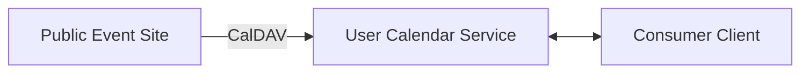
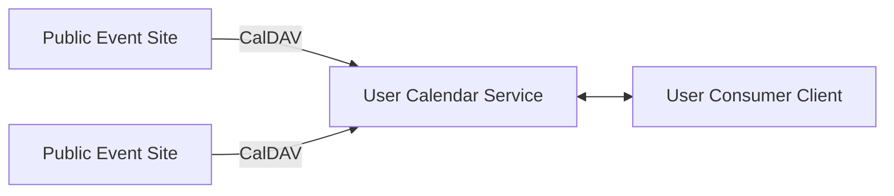
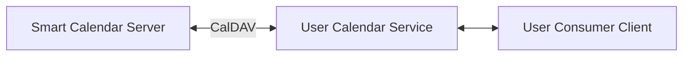
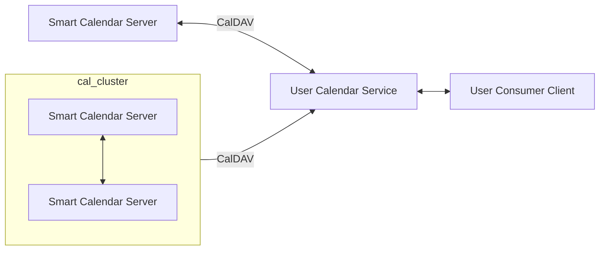

<!--
 Copyright (C) 2022 Innovate for Vegas Foundation
 
 This file is part of ov-smart-social.
 
 ov-smart-social is free software: you can redistribute it and/or modify
 it under the terms of the GNU General Public License as published by
 the Free Software Foundation, either version 3 of the License, or
 (at your option) any later version.
 
 ov-smart-social is distributed in the hope that it will be useful,
 but WITHOUT ANY WARRANTY; without even the implied warranty of
 MERCHANTABILITY or FITNESS FOR A PARTICULAR PURPOSE.  See the
 GNU General Public License for more details.
 
 You should have received a copy of the GNU General Public License
 along with ov-smart-social.  If not, see <http://www.gnu.org/licenses/>.
-->

# Smart Social Smart Calendar

The challenge is discovery and Las Vegas is not an environment easy to navigate as we attempt to find out what is going on and where.

Since a calendar is a familiar tool used by many people today (most if not all mobile phones incorporate a Google or Apple calendar for examples, not to mention day-to-day use in workplaces, schools, and so on), it is a functional, but familiar way to introduce the Smart Social platform, and so it is aimed to be the first component rolled out.

A Familiar Surprise.

The Smart Calendar component of Smart Social should function independently, but is intended to integrate nicely with other Smart Social components and external services.

## Highest Priority Considerations

## Specification Details

The proposed strategy here is a base introduction to the notion that a Smart City is not necessarily enabled by using Slack or Discord or Meetup or Eventbrite or... the list goes on. Beginning with standard calendars, iCalendar and iCalendar Streams, organizer-owned RSVPs, calendar sharing and status broadcast (in the event of reschedule, cancellation, etc).

By making use of standard map and location data structures and protocols, it is also a small matter to connect a date and time with a place, and to provide additional useful information such as parking and transit data, not to mention weather and other appropriate, useful information.

This specification is subject to continuous update over the life of the Smart Social project (and Smart Calendar Service as a part of it). Calendaring is a complicated, yet vital and ubiquitous service useful for so many things, this part of the Smart Social platform represents high-utility service to deploy and maintain.

### Standard CalDAV sharing

Services in use today from Google, Microsoft Outlook, and many others make use of CalDAV, or Calendar Distributed Authoring and Versioning to share calendar event and related information via iCalendar streams accessible at a published url, for periodic updates. As well, it is possible to provide an iCalendar stream file (a file with a suffix *.ics*) via email, QR Code, and other means, for a user calendar client to incorporate into an existing calendar.

A typical use case for CalDAV calendars, is to subscribe to a calendar with a personal calendar service, and from that point forward the event entries for the subscribed calendar will appear in the user calendar, often with color or other decoration to differentiate these subscribed events from the other user-originated events in the calendar. There are use cases accessible today wherein some central server, often an event website such as Meetup.com similar, will capture user-entered event information and make that information available as an iCalendar stream, accessible via CalDAV protocol.

In the simplest case, a user calendar service may subscribe to an iCalendar stream from a public event website with a CalDAV server, and the user calendar service will periodically download the current calendar stream and update the user calendar, which the user will interact with in any number of ways (a common example is a mobile calendar application on a phone or tablet, or a web-based calendar client in a web browser, or a calendar client built into an email or productivity application such as Microsoft Outlook):

As a user subscribed to multiple external calendars, they are able to see these external events appear in their familiar calendar interface, while they interact with their calendar as they normally would.

The shortcoming in this mode of use, is the typical placement of the external calendar event information in the public event site server, which can often remove or otherwise leave out the notions of organizer and RSVP sharing. This makes the event (the VEVENT in fact) stored in each of the Public Event Sites as dangling members of calendar collections local, or owned, by each of the event sites as illustrated.

Using standard CalDAV sharing and subscription updating methodologies, transporting iCalendar streams with current information, it is possible to not only subscribe to calendars from public event sites, but to share events *to* public servers, so that a public calendar can be stored and presented based on the synchronizing of multiple individual calendar events.

In this case the user may be using a Google or Outlook calendar service, they have subscribed to one or more calendar streams published by a Smart Calendar services, and they not only receive iCalendar stream updates from the external service, but they share their public calendar with the external service (this is optional but illustrative).

In a larger-scale deployment scenario, there may be multiple public Smart Calendar Servers publishing multiple calendars, and synchronizing between themselves in some cases. The user can share their calendar, or not, in the bi-directional synchronization model, and they may also subscribe to public calendars that are synchronizing amongst themselves.

Peer-to-peer synchronized sharing across Smart Calendar Servers (and CalDAV servers which conform to the necessary parts of the CalDAV protocol) will be used to publish and share particular calendar collections for decentralized availability. Each peer in the server sync scheme can select individual calendars to synchronize, and the user server can synchronize or ignore particular calendar collections as the user chooses.

The user server can synchronize its events and updates to peer servers when the peer has accepted a subscription to the user calendar. The Smart Calendar Server can accept a public calendar URL for synchronizing, and may confirm the subscription via email to the calendar owner, or the server can optionally accept a calendar anonymously (this is a risk to be analyzed).

### SmartCal API

Modern applications are written with RESTful and GraphQL API access in mind. The Smart Calendar Server is intended to service well-establish legacy CalDAV transactions, but also service applications locally and remotely to make use of calendar services in a variety of ways.

The core services will be analogs to CalDAV services, with the data payloads matching, at least, the expectations of the CalDAV protocol and iCalendar steam transport. The data is returned in JSON format in the core implementation of a RESTful API, with RFC 7465 as a guide.

The basic API service must accept a calendar component (eg a VEVENT) input from an authenticated and authorized user, via an HTML form submission or similar RESTful POST or PUT. Where CalDAV synchronization is server pull, this interaction will be user or client push, making user authentication and authorization for a specific calendar collection (or calendar component) essential.

Unlike the CalDAV peer synchronization relationships, the initial major version of the SmartCal API is intended to be called specifically by some client or server for a particular interaction. In the RESTful case, this would be multiple REST POST or PUT transactions, in the case of a GraphQL interface this would be multiple mutations occurring individually. The CalDAV synchronization protocol is fairly simply, the source server is always correct, with a check of sequence numbers per component where appropriate. Similarly, the SmartCal API assumes component-level granularity in its initial major version, and does not account for merges.

The SmartCal API will be published with OpenAPI documentation to enable code generation for callers and to make visible the features implemented along the development timeline. Aside from the CalDAV analogs, there is substantial latitude to create sensible interfaces to calendar data and service the Smart Calendar Server implements, either on its own or in conjunction with other Smart Social services. This will be noteworthy when implementing external integrations, which may be bi-directional. For example, integration with Meetup.com APIs may include a Meetup.com adaptor to the Smart Social APIs so that a client written for Meetup.com endpoints might work with Smart Social. This is by no means a high priority feature but this would make adoption by third party application developers that much easier.

## External Reference Materials

[vCalendar RFC](https://datatracker.ietf.org/doc/html/rfc5545)

[CalConnect.org Dev Guide (visit the wiki)](https://devguide.calconnect.org/)

[Schema.org Event type](https://schema.org/Event)

[iCalendar.org](https://icalendar.org/)

[iCalendar in JSON format](https://www.rfc-editor.org/rfc/rfc7265.html)

## User Stories

Individual stories may be converted into Issues, or consolidated or exploded as needed for development and implementation.

**Terms**:

- **Consumer**: an end user of Smart Calendars, may be a human or some automation.
- **Organizer**: an end user of Smart Calendars, either as Publisher or Source
- **ExtSource**: an external origin for Calendar content to capture, store, and possibly re-publish
- **IntSource**: an internal origin of Calendar content to store and publish.
- **Peer**: a special case ExtSource or IntSource.
- **Developer**: one who makes use of Smart Calendar APIs (or CalDAV) or similar to build on the platform

### Typical Uses

- **Card**: As a Consumer, I would like to subscribe to a central source of Calendar event information using my normal Calendar tools.
  - **Conversation**: With mobile device use nearly ubiquitous, the casual Consumer has access to CalDAV Calendar services from Google, Microsoft/Outlook, and other services. The ability to discover and subscribe to calendars from a central location will make it easier to find events of interest and follow them in a standard way.
  - **Confirmation**:
    - Consumer is able to discover and subscribe to Calendar events using their standard Calendar tools such as Google Calendar, Microsoft Outlook, Apple iCalendar, and similar, to integrate events into their daily schedule.

Converted to https://github.com/InnovateForVegas/ov-smart-social/issues/4

---

- **Card**: As a Consumer, I would like to RSVP to an Event on a Calendar to which I am subscribed or which I am following on the Smart Calendar server(s).
  - **Conversation**: The RSVP Fanout problem is real. As Organizers publish Events to various different platforms and services, the RSVP process can lead to multiple RSVPs from one Consumer across platforms, or the lack of useful RSVP capture at all for a given platform. The goal here is to enable a Consumer to RSVP to an Event (assuming it is a public event open to RSVPs without invitations) and thus follow that Event for updates.
  - **Confirmation**:
    - Consumer is able to RSVP to an Event and later receive updates to the Event made by Organizer and disseminated via email (at least).

Converted to https://github.com/InnovateForVegas/ov-smart-social/issues/5

---

- **Card**: As a Consumer, I would like to receive update notifications when Calendars to which I am subscribed change with new or updated Events.
  - **Conversation**: Calendar servers are generally email-centric for managing organizers and subscribers (that is, anyone who has a Calendar usually has an email address associated with it), and so notifications are typically sent via email to those invited to or attending Events within a particular Calendar. Here, it is useful to notify those interested in new events a notification regardless of their attendee status for a particular event. This is not typical behavior, but will have utility for event discovery.
  - **Confirmation**:
    - Consumer subscribed to or otherwise following a Calendar receives notifications via email (at least) when a new Event is added to Calendar, or if an existing Event is updated, regardless of their attendee status for a given Event.

Converted to https://github.com/InnovateForVegas/ov-smart-social/issues/6

---

- **Card**: As an Organizer, I would like to maintain my own calendar, and publish it to a central server to share with others, but maintain control of my calendar events.
  - **Conversation**: The CalDAV protocol and workflow enables an origin Calendar maintained by an Organizer, to publisher their calendar for public visibility, and for synchronizing with other CalDAV servers. A central Smart Calendar server can capture Calendars and make them more easily discoverable and visible, while enabling the Organizer to update or even cancel an Event on their origin Calendar, which propagates to the Peering Smart Calendar server(s).
  - **Confirmation**:
    - Organizer is able to share a public calendar with Smart Calendar server, and publish events in their Origin Calendar that are captured by the Smart Calendar server, and update or cancel those Events, with the changes also propagating to the Smart Calendar server(s).

Converted to https://github.com/InnovateForVegas/ov-smart-social/issues/7

---

- **Card**: As an Organizer, I would like receive RSVP information from Consumers regardless of where my Calendar Event is published.
  - **Conversation**: RSVP Propagation from shared calendars is supported in CalDAV. If a Consumer is viewing an Event shared via a Smart Calendar server, and RSVPs to that Event, the RSVP must propagate to the Organizer (specifically to their origin ExtSource). For example, an Event published on Organizers Google Calendar, shared to Smart Calendar, receives an RSVP from Consumer, that RSVP must propagate to the Organizer’s Google Calendar by way of the Smart Calendar Server.
  - **Confirmation**:
    - Organizer receives RSVP user information propagated from Smart Calendar servers to their origin Calendar Server.

Converted to https://github.com/InnovateForVegas/ov-smart-social/issues/8

---
